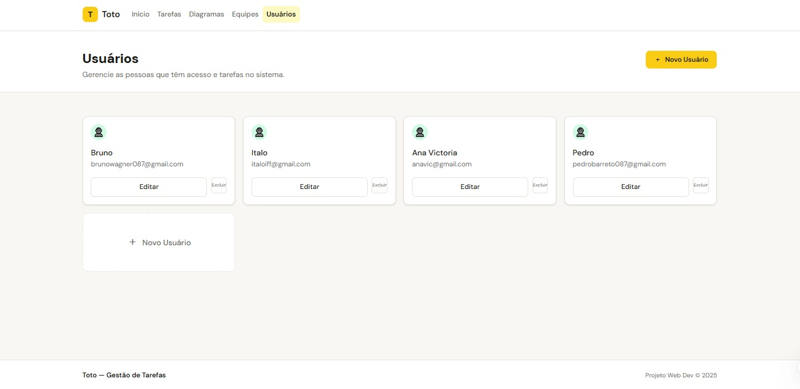
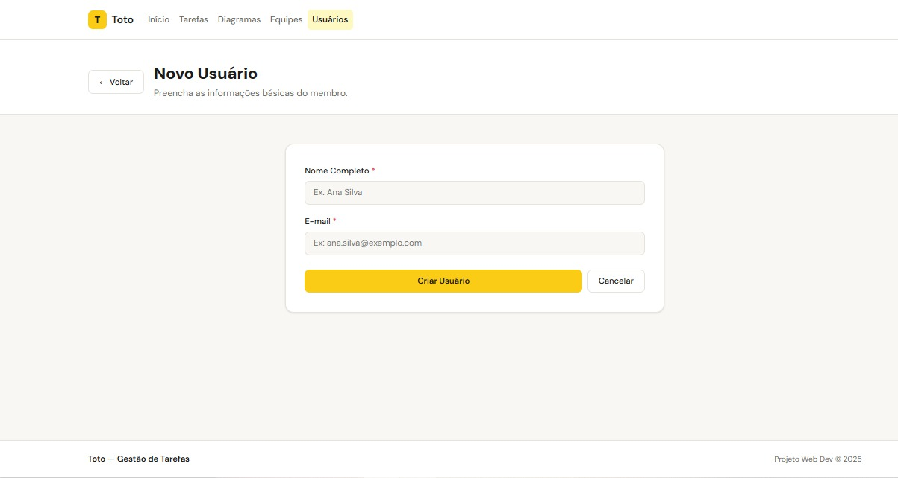
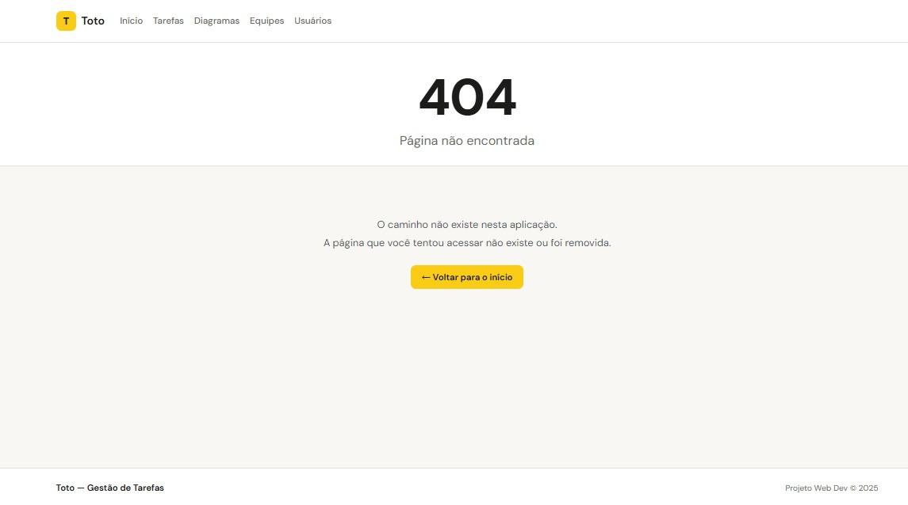
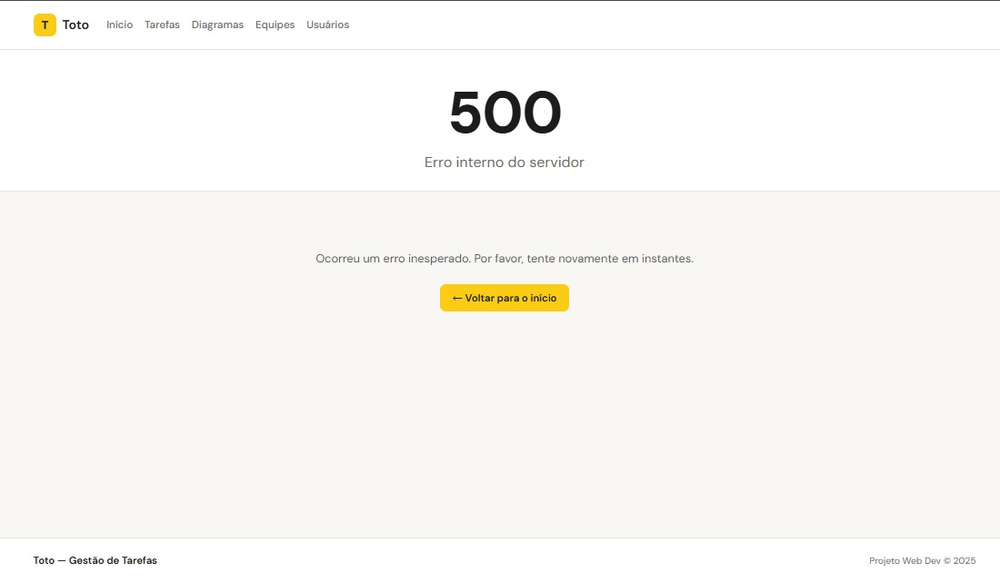

# Toto  
### Organize projetos. Conecte equipes. Entregue resultados.

---

## Sobre o Projeto

O **Toto** é uma plataforma de gerenciamento de projetos no estilo Kanban que transforma a organização de tarefas em uma experiência visual, colaborativa e eficiente.

A proposta é simples: permitir que equipes criem quadros personalizados, organizem tarefas em colunas intuitivas e acompanhem o progresso em tempo real — tudo de forma clara e estruturada.

---

## Propósito

O Toto nasce com o objetivo de tornar a gestão de projetos mais simples, organizada e colaborativa.

Cada quadro criado representa:

- Mais clareza no fluxo de trabalho  
- Mais colaboração entre equipes  
- Mais controle sobre prazos e entregas  
- Mais produtividade no dia a dia  

---

## Filosofia

O projeto valoriza três pilares fundamentais:

| Pilar | Descrição |
|-------|------------|
| Organização | Visualização clara das tarefas e do andamento do projeto. |
| Colaboração | Comunicação integrada e trabalho em equipe eficiente. |
| Simplicidade | Interface intuitiva e foco total na experiência do usuário. |

---

## Como Funciona

### Projetos e Quadros

Cada projeto possui um ou mais quadros Kanban, compostos por colunas personalizáveis como:

- Backlog  
- Em Andamento  
- Concluído  

Os quadros permitem estruturar o fluxo de trabalho de forma visual e adaptável à necessidade da equipe.

---

### Gestão de Tarefas

Dentro dos quadros, os usuários podem:

- Criar cartões com título, descrição, responsável e prazo  
- Mover tarefas entre colunas  
- Atualizar informações da tarefa  
- Registrar o histórico de movimentações  

---

### Colaboração

A equipe pode:

- Comentar nos cartões  
- Mencionar outros usuários  
- Acompanhar alterações em tempo real  

Todas as interações ficam organizadas e vinculadas à tarefa correspondente.

---

## Perfis de Acesso

-  **Criador do Projeto** — Gerencia quadros, colunas e permissões.  
-  **Membro da Equipe** — Cria, movimenta e acompanha tarefas.  
-  **Administrador** — Supervisiona usuários, projetos e atividades da plataforma.  

Um mesmo usuário pode participar de vários projetos com permissões distintas.

---

## Tecnologias Utilizadas

- Java 17+  
- Spring Boot  
- API REST  
- Sistema de controle de acesso e segurança  

---

## Visão

Ser uma referência em gestão visual de projetos, unindo organização, colaboração e tecnologia para impulsionar equipes a alcançarem melhores resultados.

---

## Comunidade

O Toto acredita que projetos são feitos por pessoas — não apenas por tarefas.  
Cada quadro representa uma equipe alinhada, colaborando com clareza e propósito.

---

## Índice

- [Sobre o Projeto](#sobre-o-projeto)
- [Manual de Execução](#manual-de-execução)
- [Guia de Telas](#guia-de-telas)
- [Release](#release)


## Manual de Execução

### Pré-requisitos

- Java 17 ou superior
- Maven (ou utilize o `mvnw` incluso no projeto)

### Passos

**1. Clone o repositório:**
```bash
git clone https://github.com/TOTOProjeto/Toto.git
cd Toto
```

**2. Execute a aplicação:**
```bash
./mvnw spring-boot:run
```
> No Windows, use `mvnw.cmd spring-boot:run`

**3. Acesse no navegador:**
```
http://localhost:8080
```

**Console do banco H2 (opcional):**
```
http://localhost:8080/h2-console
```
- JDBC URL: `jdbc:h2:mem:testdb`
- Usuário: `sa`
- Senha: *(deixar em branco)*

---

## Guia de Telas
 
### Listagem de Usuários
Tela principal de gerenciamento de membros do sistema, com opções de editar e excluir cada usuário.
 

 
---
 
### Cadastro de Usuário
Formulário para criação de novos usuários, com campos de Nome Completo e E-mail.
 

 
---
 
### Erro 404 — Página não encontrada
Tela customizada exibida quando o usuário acessa uma rota inexistente.
 

 
---
 
### Erro 500 — Erro interno do servidor
Tela customizada exibida quando ocorre um erro inesperado na aplicação.
 

 
---
 
## 🔖 Release
 
[📦 Versão Final v2.0](https://github.com/TOTOProjeto/Toto/releases/tag/v2.0.0-p2)
